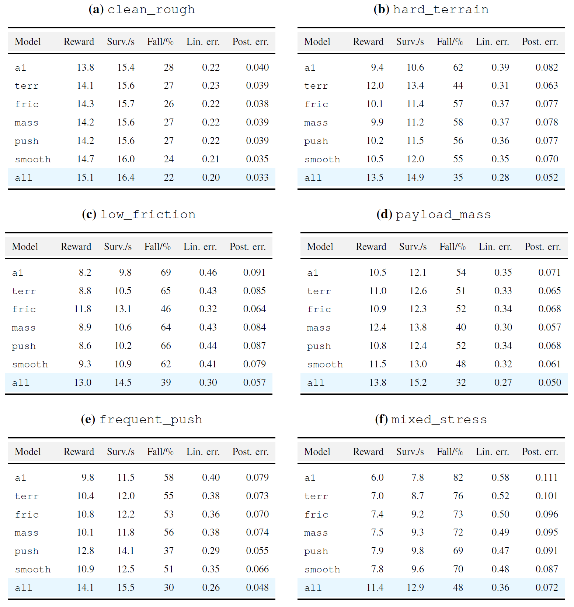
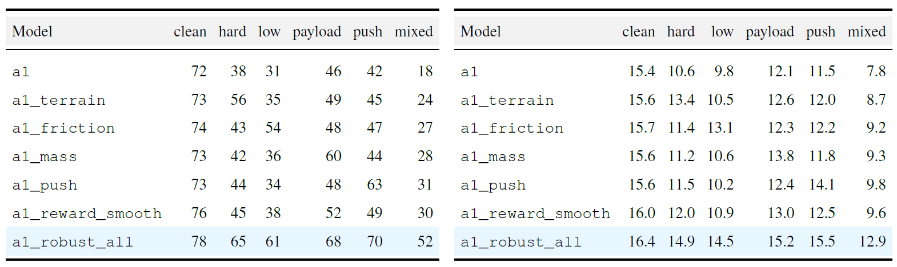
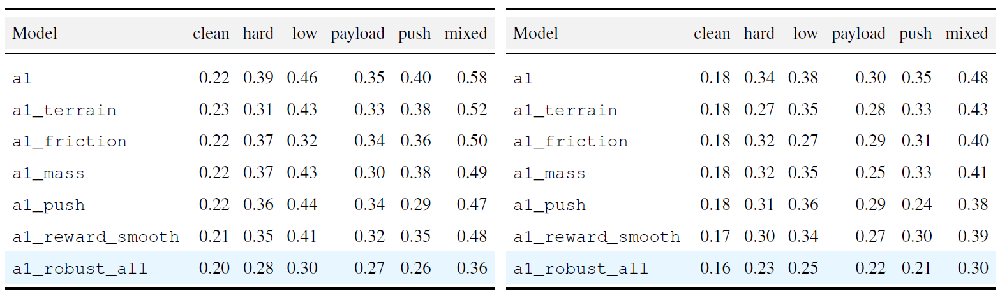
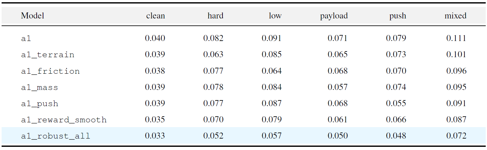
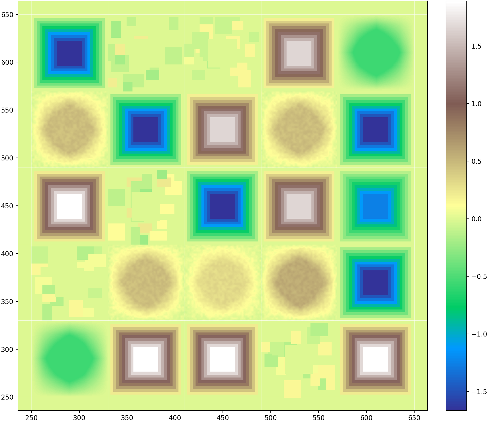
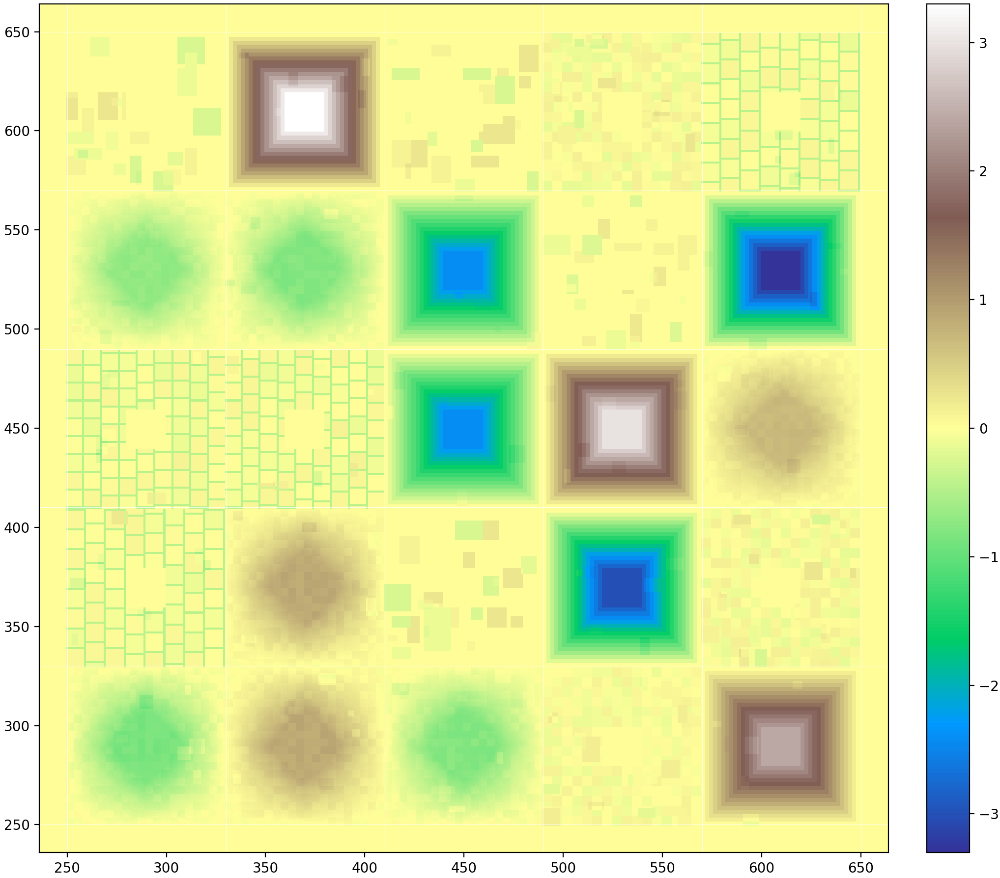

# Robustifying Reinforcement-Learned Quadruped Locomotion under Terrain and Dynamics Shifts

[Ruofan Yang](https://github.com/RENLEILEI-Y), [Juquan Wen](), [Zihan Zhou](https://github.com/littletoilet)
<div>
<a href="https://github.com/littletoilet/project_lab" target='_blank' style="text-decoration: none;"></a>
<a href="https://github.com/littletoilet/project_lab/stargazers" target='_blank' style="text-decoration: none;"></a>
</div>

[[project](https://littletoilet.github.io/project_lab/)]

#### 🔥🔥🔥 News

- **2026-05-29:** This repo is released.

---

> **Abstract:** Reinforcement-learning controllers for quadruped robots can acquire agile locomotion policies from large-scale simulation, but policies trained in a nominal rough-terrain setting often fail when terrain geometry, contact friction, payload mass, and external perturbations change simultaneously. This work studies a central question: *how can an existing Legged Gym PPO locomotion pipeline be systematically modified so that the resulting Unitree A1 policy is not merely successful on the training terrain, but robust under coupled terrain and dynamics shifts?* We formulate robustness improvement as a distribution-expansion problem over terrain, physical parameters, and disturbance processes, and we implement a three-component solution within Isaac Gym and Legged Gym: complex-terrain enrichment, domain randomization of friction and base mass with external pushes, and reward shaping for posture stability and action smoothness.

## 🔎 Results

<details open>
  <summary>Quantitative Results</summary>

  - Results in Tab. 6 of the main paper

  <p align="center">
    
  </p>

  <details>
  <summary>More Quantitative Results</summary>

  - Results in Tab. 7 and 8 of the main paper, representing success rate and survive time, respectively.

  <p align="center">
    
  </p>

  - Results in Tab. 9, 10, and 11, representing linear velocity error, yaw-rate error and posture error, respectively.

  <p align="center">
    
    
  </p>
  </details>

</details>

<details open>
  <summary>Visual Results</summary>

  - Terrain Visualtization

  <div align="center">
    
    &nbsp;&nbsp;
    
    <br>
    <span style="display:inline-block; width:48.5%; text-align:center;"><p>Clean Rough Terrain</p></span>
    &nbsp;&nbsp;
    <span style="display:inline-block; width:48%; text-align:center;"><p>Hard Terrain</p></span>
  </div>

  - More visual results are in our [project website](https://littletoilet.github.io/project_lab/).
</details>


## ⚙️ Reproduction Guide

### Environment Setup

The code is expected to run in a Conda environment named `legged_gym` with
Python 3.8.

#### Isaac Gym

If you need to obtain Isaac Gym from NVIDIA, download Isaac Gym Preview 4 from:

```text
https://developer.nvidia.com/isaac-gym/download
```

If the package is provided as `IsaacGym_Preview_4_Package.tar.gz`, extract it
before installation:

```bash
tar -xf IsaacGym_Preview_4_Package.tar.gz
```

#### Conda Environment

Create and activate the Conda environment:

```bash
conda create -n legged_gym python=3.8 -y
conda activate legged_gym
```

Install the local packages from the repository root:

```bash
cd isaacgym/python
pip install -e .

cd ../../rsl_rl
pip install -e .

cd ../legged_gym
pip install -e .
```

If PyPI access is slow, use the Tsinghua mirror:

```bash
pip install -e . -i https://pypi.tuna.tsinghua.edu.cn/simple
```

Recommended compatibility packages:

```bash
pip install numpy==1.23.5 tensorboard -i https://pypi.tuna.tsinghua.edu.cn/simple
conda run -n legged_gym python -m pip install "onnxscript==0.1.0" "onnx==1.16.0"
```

#### Runtime Variables

Set these variables in each new terminal before training or inference:

```bash
conda activate legged_gym
export LD_LIBRARY_PATH=$CONDA_PREFIX/lib:$LD_LIBRARY_PATH
export TORCH_EXTENSIONS_DIR=/tmp/torch_extensions_legged_gym
export MPLCONFIGDIR=/home/RuofanYang/.tmp/matplotlib
```

`LD_LIBRARY_PATH` lets Isaac Gym find Conda libraries such as
`libpython3.8.so.1.0`. `TORCH_EXTENSIONS_DIR` and `MPLCONFIGDIR` place generated
caches in writable directories.

To select a GPU manually, set `CUDA_VISIBLE_DEVICES`:

```bash
export CUDA_VISIBLE_DEVICES=2
```

Use any available GPU ID on the current machine.

#### Sanity Checks

Check Python syntax for the main Stage 2 configuration and scripts:

```bash
python -m py_compile \
  legged_gym/legged_gym/envs/a1/a1_config.py \
  legged_gym/legged_gym/envs/__init__.py \
  legged_gym/legged_gym/scripts/eval_robustness.py
```

Check that the A1 tasks are registered:

```bash
conda run -n legged_gym python -c "from legged_gym.envs import *; from legged_gym.utils import task_registry; print([k for k in task_registry.task_classes.keys() if k.startswith('a1')])"
```

The output should include:

```text
a1, a1_terrain, a1_friction, a1_mass, a1_push, a1_reward_smooth, a1_robust_all
```

### Training

Run all training commands from the repository root. `--headless` is useful on
remote servers without a display. Local machines with working visualization can
try running without it. Training outputs are written under:

```text
legged_gym/logs/
```

#### Basic Training

Train the baseline A1 policy:

```bash
conda run -n legged_gym python legged_gym/legged_gym/scripts/train.py \
  --task=a1 \
  --headless \
  --seed 3
```

#### Robustness Ablation

Stage 2 uses one-factor-at-a-time robustness ablations plus a final combined
model. Each variant is compared against the base `a1` / `rough_a1` baseline.

| Task | Experiment directory | Change |
| --- | --- | --- |
| `a1` | `rough_a1` | Baseline |
| `a1_terrain` | `ablation_a1_terrain` | Increase difficult terrain ratio |
| `a1_friction` | `ablation_a1_friction` | Widen friction randomization range |
| `a1_mass` | `ablation_a1_mass` | Add base mass randomization |
| `a1_push` | `ablation_a1_push` | Strengthen external push disturbances |
| `a1_reward_smooth` | `ablation_a1_reward_smooth` | Increase posture stability and action smoothness penalties |
| `a1_robust_all` | `robust_a1_all` | Enable all robustness improvements together |

Train one Stage 2 task with:

```bash
env LD_LIBRARY_PATH=/home/RuofanYang/.conda/envs/legged_gym/lib:$LD_LIBRARY_PATH \
  TORCH_EXTENSIONS_DIR=/tmp/torch_extensions_legged_gym \
  MPLCONFIGDIR=/home/RuofanYang/.tmp/matplotlib \
  conda run -n legged_gym python legged_gym/legged_gym/scripts/train.py \
  --task=a1_terrain --headless --max_iterations=500
```

Recommended training order:

```text
a1_terrain
a1_friction
a1_mass
a1_push
a1_reward_smooth
a1_robust_all
```

If the final combined model was first trained for 500 iterations and more time
is available, resume it to 1000 iterations:

```bash
env LD_LIBRARY_PATH=/home/RuofanYang/.conda/envs/legged_gym/lib:$LD_LIBRARY_PATH \
  TORCH_EXTENSIONS_DIR=/tmp/torch_extensions_legged_gym \
  MPLCONFIGDIR=/home/RuofanYang/.tmp/matplotlib \
  conda run -n legged_gym python legged_gym/legged_gym/scripts/train.py \
  --task=a1_robust_all --headless --resume --max_iterations=1000
```

### Inference

Use this section for trained-policy evaluation and rollout visualization. The
evaluation script loads the latest checkpoint from
`legged_gym/logs/<experiment_name>/` by default.

#### Robustness Evaluation

Evaluate all models on all scenarios:

```bash
for task in \
  a1 \
  a1_terrain \
  a1_friction \
  a1_mass \
  a1_push \
  a1_reward_smooth \
  a1_robust_all
do
  conda run -n legged_gym python legged_gym/legged_gym/scripts/eval_robustness.py \
    --task=$task \
    --scenario=all \
    --num_envs=64 \
    --episodes=50 \
    --output_dir=legged_gym/logs/phase2_eval
done
```

Results are appended to:

```text
legged_gym/logs/phase2_eval/robustness_eval.csv
legged_gym/logs/phase2_eval/robustness_eval.md
```

Single-factor comparison examples:

```bash
# Hard terrain: baseline vs terrain-enhanced model
conda run -n legged_gym python legged_gym/legged_gym/scripts/eval_robustness.py --task=a1 --scenario=hard_terrain --num_envs=64 --episodes=50
conda run -n legged_gym python legged_gym/legged_gym/scripts/eval_robustness.py --task=a1_terrain --scenario=hard_terrain --num_envs=64 --episodes=50

# Low friction: baseline vs friction-enhanced model
conda run -n legged_gym python legged_gym/legged_gym/scripts/eval_robustness.py --task=a1 --scenario=low_friction --num_envs=64 --episodes=50
conda run -n legged_gym python legged_gym/legged_gym/scripts/eval_robustness.py --task=a1_friction --scenario=low_friction --num_envs=64 --episodes=50

# Payload mass: baseline vs mass-randomized model
conda run -n legged_gym python legged_gym/legged_gym/scripts/eval_robustness.py --task=a1 --scenario=payload_mass --num_envs=64 --episodes=50
conda run -n legged_gym python legged_gym/legged_gym/scripts/eval_robustness.py --task=a1_mass --scenario=payload_mass --num_envs=64 --episodes=50

# Frequent push: baseline vs push-enhanced model
conda run -n legged_gym python legged_gym/legged_gym/scripts/eval_robustness.py --task=a1 --scenario=frequent_push --num_envs=64 --episodes=50
conda run -n legged_gym python legged_gym/legged_gym/scripts/eval_robustness.py --task=a1_push --scenario=frequent_push --num_envs=64 --episodes=50

# Smoothness reward: baseline vs posture/action-smoothness model
conda run -n legged_gym python legged_gym/legged_gym/scripts/eval_robustness.py --task=a1 --scenario=clean_rough --num_envs=64 --episodes=50
conda run -n legged_gym python legged_gym/legged_gym/scripts/eval_robustness.py --task=a1_reward_smooth --scenario=clean_rough --num_envs=64 --episodes=50
```

Final combined stress test:

```bash
conda run -n legged_gym python legged_gym/legged_gym/scripts/eval_robustness.py \
  --task=a1_robust_all \
  --scenario=mixed_stress \
  --num_envs=64 \
  --episodes=100

conda run -n legged_gym python legged_gym/legged_gym/scripts/eval_robustness.py \
  --task=a1 \
  --scenario=mixed_stress \
  --num_envs=64 \
  --episodes=100
```

To evaluate a specific run and checkpoint instead of the latest checkpoint:

```bash
conda run -n legged_gym python legged_gym/legged_gym/scripts/eval_robustness.py \
  --task=a1_terrain \
  --scenario=all \
  --num_envs=64 \
  --episodes=50 \
  --load_run=May27_10-20-00_phase2_terrain \
  --checkpoint=499
```

### Visualization

The visualization script exports PNG frames and static diagnostic figures. It
does not open a live rendering window or encode videos directly. The maximum
number of frames is controlled by `--max_frames`, with a default of `1200`.

Generate overview images for the six test scenarios:

```bash
conda run -n legged_gym python legged_gym/legged_gym/scripts/visualize_robustness.py \
  --viz_suite=terrain_gallery \
  --task=a1 \
  --terrain_width=3840 \
  --terrain_height=2160 \
  --output_dir=legged_gym/logs/phase2_visualization
```

Generate one-factor ablation comparison frame sequences:

```bash
conda run -n legged_gym python legged_gym/legged_gym/scripts/visualize_robustness.py \
  --viz_suite=ablations \
  --num_envs=25 \
  --max_frames=1200 \
  --frame_stride=2 \
  --output_dir=legged_gym/logs/phase2_visualization
```

Generate final combined stress comparison frames for `a1` vs `a1_robust_all`:

```bash
conda run -n legged_gym python legged_gym/legged_gym/scripts/visualize_robustness.py \
  --viz_suite=final \
  --num_envs=25 \
  --max_frames=1200 \
  --frame_stride=2 \
  --output_dir=legged_gym/logs/phase2_visualization
```

Quickly inspect one model and scenario:

```bash
conda run -n legged_gym python legged_gym/legged_gym/scripts/visualize_robustness.py \
  --viz_suite=single \
  --task=a1_robust_all \
  --scenario=mixed_stress \
  --num_envs=25 \
  --max_frames=300 \
  --frame_stride=2 \
  --output_dir=legged_gym/logs/phase2_visualization
```
